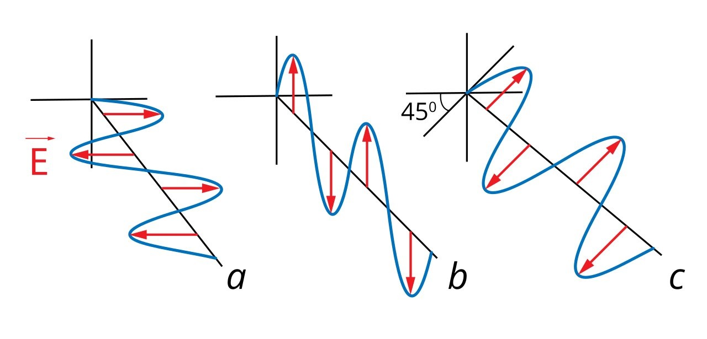

---
## Front matter
lang: ru-RU
title: Доклад
subtitle: Квантовое шифрование. Квантовая передача информации
author:
  - Шалыгин Г. Э.
institute:
  - Российский университет дружбы народов, Москва, Россия
date:

## i18n babel
babel-lang: russian
babel-otherlangs: english

## Formatting pdf
toc: false
toc-title: Содержание
slide_level: 2
aspectratio: 169
section-titles: true
theme: metropolis
header-includes:
 - \metroset{progressbar=frametitle,sectionpage=progressbar,numbering=fraction}
 - '\makeatletter'
 - '\beamer@ignorenonframefalse'
 - '\makeatother'
---

# Информация

## Докладчик

  * Шалыгин Георгий Эдуардович
  * студент НФИ-02-20
  * Российский университет дружбы народов

# Вводная часть

## Актуальность

- Информация является одним из самых ценных ресурсов. Ее защита от несанкционированного доступа является одной из важнейших задач информационной безопасности.
- Развитие квантовых вычислений угрожает классическим криптографическим методам, таким как RSA и ECC. Поиск новых методов шифрования становится актуальным.
- Квантовое шифрование обеспечивает более высокий уровень безопасности при передаче данных, попытка перехвата может быть обнаружена.

## Цели и задачи

- Цель: изучить принципы и алгоритмы квантового шифрования.
- Задачи доклада:
  - Рассмотреть основные понятия квантового шифрования и квантовой передачи информации.
  - Познакомиться с основными протоколами квантового шифрования.
  - Обсудить перспективы развития квантового шифрования и квантовой передачи информации.

## Основы квантовой криптографии

- Основана на передаче квантовых состояний и принципах квантовой механики.
- В общем случае, протокол квантового шифрования включает в себя следующие этапы:

  1. **Генерация секретного ключа**. На этом этапе Alice и Bob генерируют секретный ключ, используя один из основных протоколов квантового обмена ключами.
  2. **Шифрование сообщения**. На этом этапе Alice и Bob используют классические метод симметричного шифрования для шифрования сообщения с использованием секретного ключа.
  3. **Передача сообщения**.
  4. **Расшифровка сообщения**.

## Поляризация фотонов

- Поляризация, колебание электрического поля $\vec{E}$. Пример линейно поляризованных волн показан на рисунке.

- $a, b$ – базис +, горизонтально-вертикальный (H/V); $45^o, 135^o$ – базис $\times$, и диагонально-антидиагональный (D/A).

  {#fig:001 width=35%}

## Передача бита с помощью фотона

- Рассмотрим два базиса: горизонтально-вертикальный(+) и диагональный ($\times$).

  Пусть — и $\diagup$ соответствует 0, | и $\diagdown$ соответствуют 1.

- Два участника: один поляризует фотон и отправляет другому. Другой измеряет поляризацию, случайно выбирая базис.

- Если фотон был поляризован в базисе + и измерен в том же базисе, то получатель однозначно узнает закодированный бит.

- Если же для измерения был выбран базис $\times$, то есть один из фильтров: $45^o$ или $135^o$, свет проходит через эти фильтры с вероятностью $\frac{1}{2}$, то есть закодированный бит узнать не получится. Этот принцип отражен на рисунке.

## Иллюстрация измерения поляризации

{#fig:002}

## Протокол BB84 (1984 г., Ч. Беннетт, Ж. Брассар)

Шаги алгоритма следующие:

1. Алиса шифрует передаваемую строку битов с помощью фотонов, поляризованных согласно договорённости. Для каждого бита она случайно выбирает базис: + или $\times$.

   \begin{table}[]
   \begin{tabular}{|l|llllll|}
   \hline
   \multicolumn{1}{|c|}{Сообщение} & 1 & 1                                         & 0                     & 1 & 0  & 1 \\
   Базис                           & + & \multicolumn{1}{c}{\times} & \times & + & +  & + \\
   Поляризация                     & | & \textbackslash{}                          & /                     & | & -- & | \\ \hline
   \end{tabular}
   \end{table}

## Протокол BB84 (Ч. Беннетт, Ж. Брассар, 1984 г.)

2. Боб принимает полученные импульсы и декодирует. Для каждого импульса (считаем, фотона) он выбирает случайно базис (+ или $\times$) и измеряет состояние фотона в данном базисе.
3. После оба участника обмениваются последовательностью выбора базисов для поляризации и измерения поляризации фотонов. Из вышесказанного следует, что биты, закодированные и прочитанные в одних базисах, будут известны обоим участникам. Эти биты и принимаются как общий секретный ключ.

## Протокол BB84 (Ч. Беннетт, 1992 г.)

-  Может использовать неортогональные квантовые состояния.
- Показывает принципиальную возможность такого подхода.
- Использует меньше состояний.

## Протокол E91 (А. Эркерт, 1991 г.)

- Основан на квантовой запутанности.
- Создаются ЭПР-пары фотонов, фотоны из которых отправляются Алисе и Бобу.
- Если базис совпал, то бит сохраняется.

{#fig:003 width=35%}

{#fig:004 width=30%}

## Детекция ошибок

-  Способ был предложен 1991 году Ч. Беннетом.
- Последовательности Алисы и Боба перемешиваются и разбиваются на блоки.
- Основная идея состоит в проверке чётности блоков: блоки проверяют на чётность в несколько итераций, уменьшая каждый размер именно тех блоков, чётность которых не совпала. Достаточно мелкие блоки отбрасываются при обнаружении в них ошибки.
- Неравенства Белла для алгоритмов на ЭПР-парах.

## Реализация

- 1989 г., Беннет и Брассар, Исследовательский центр IBM. Квантовый канал длиной 32 см.
- 48 км, Национальная лаборатория в Лос-Аламосе.
- 67 км, GAP Optique.
- 87 км, Mitsubishi Electric. Скорость – 1 байт/с.
- Команда исследователей из Китая, Сингапура, Великобритании смогла с помощью спутника «Мо-Цзы» объединить города Наньшань и Дэлинха: 1120 км.

# Вывод

- Передовая, развивающаяся область, защищено от атаки с помощью квантовых вычислений.
- Другой уровень защищенности по сравнению с классическими подходами.
- Сложные в реализации технологии.
- ResearchAndMarkets: рынок квантовой криптографии оценен в $93,1 млн.
